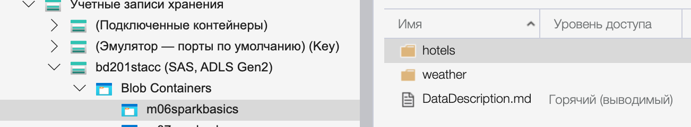
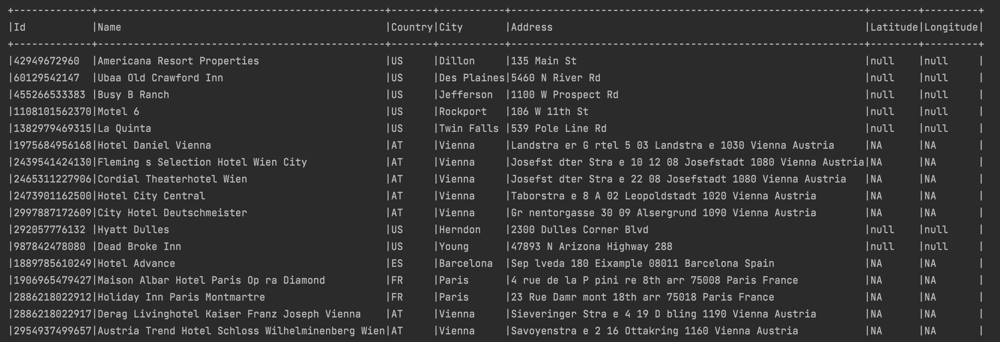
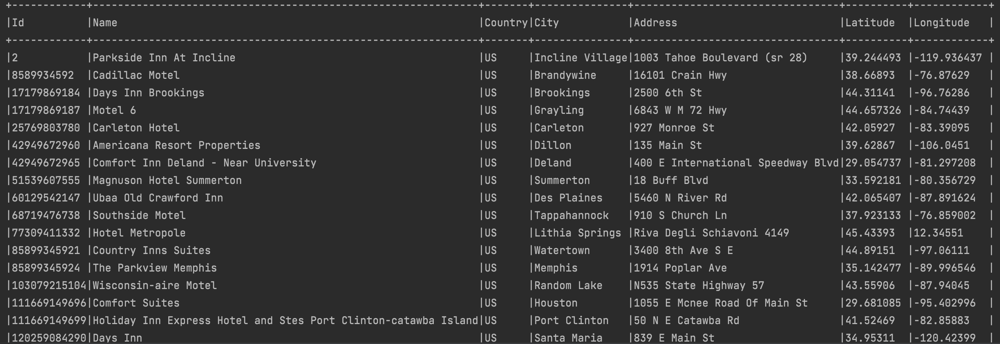
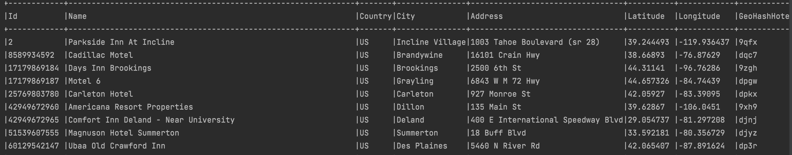
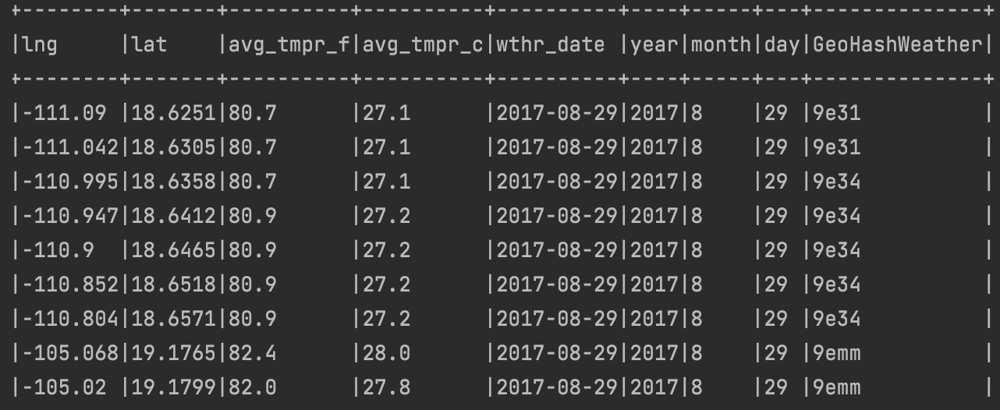
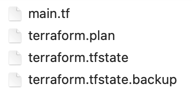
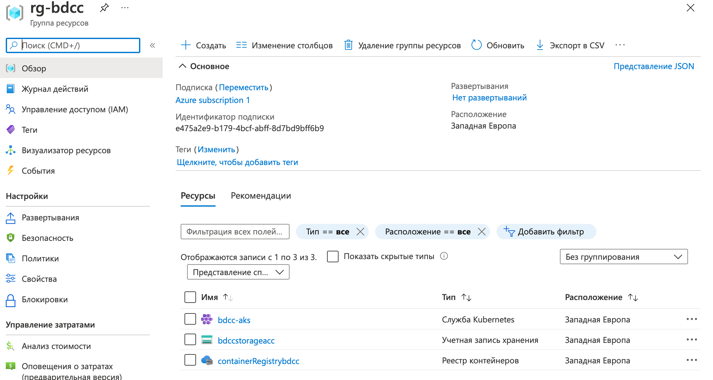
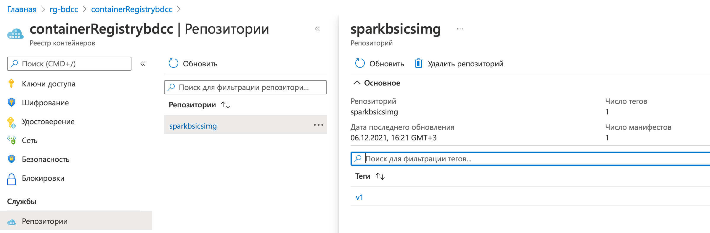
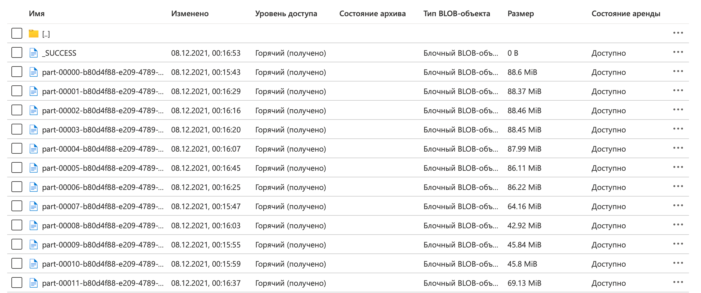

# Spark Basic Homework

* Creating Spark ETL job to read data from storage container

Connecting Storage Account in Azure Storage Explorer use this SAS UR



Creating Spark ETL job to read data from storage container
```
//  Creating Spark configuration
val conf = new SparkConf().setAppName("SparkBasics")

//  Setting parametres for connection with Azure ADLS gen2 storages
conf.set("fs.azure", "org.apache.hadoop.fs.azure.NativeAzureFileSystem")
conf.set("fs.azure.account.key.kkladls.blob.core.windows.net", "BqwznS7iDuURkFWwe7yduzkCkwTHyIGRq0kSoazy87e8jOzwLsyTW42Ty6kPfCGCH9ImCyjeLq0vua2ESmeZUA==")
conf.set("fs.azure.account.key.bdccstorageacc.blob.core.windows.net", "TgKk9CtmHgZ3RB4+un9PQqnyX9D1k0OEPJy0J99cFYrLvFKN5eN/0+sptNlrM41YCyqKfrv8XJPL38qhGXn1Qg==")

//  Creating Spark session and run spark job
val spark = SparkSession.builder
    .master("local[*]")
    .appName("SparkBasics")
    .config(conf)
    .getOrCreate()
```

Reading data

```
//  Reading hotels data from storage container testcontainers@kkladls
    var hotels_df = spark.read
      .option("header", "true")
      .option("inferSchema", "true")
      .csv("wasbs://testcontainers@kkladls.blob.core.windows.net/hotels/")

//  Reading weather data from storage container testcontainers@kkladls into DataFrame weather_df
var weather_df = spark.read
.option("header", "true")
.option("inferSchema", "true")
.parquet("wasbs://testcontainers@kkladls.blob.core.windows.net/weather")
```

* Checking hotels data on incorrect values (Latitude & Longitude). For incorrect values mapping (Latitude & Longitude) from OpenCage Geocoding API in job on fly (Via REST API).

```
//  Creating OpenCageClient with API key
    val client = new OpenCageClient("9d9b253d364c4127a4ac10308ef59ffe")

    val selectdf = hotels_df.filter((hotels_df("Latitude").isNull) || (hotels_df("Longitude").isNull) || (hotels_df("Latitude") === "NA") || (hotels_df("Longitude") === "NA"))
    selectdf.show(false)

      hotels_df
        //    Check hotels data on incorrect (null) values (Latitude & Longitude)
        .filter((hotels_df("Latitude").isNull) || (hotels_df("Longitude").isNull) || (hotels_df("Latitude") === "NA") || (hotels_df("Longitude") === "NA"))
        .foreach(row => {
            val address = row(4)
            val city = row(3)
            val country = row(2)
            val query = address + "," + city + "," + country

            //      Getting latitude and longitude from request with query string contented a address
            val responseFuture = client.forwardGeocode(query)
            val response = Await.result(responseFuture, 5.seconds)
            val location = response.results.head.geometry

            //      Changing value of Latitude and Longitude columns using a transformation function withColumn()
            hotels_df = hotels_df.withColumn("Latitude",
                when(col("Address") === address && col("City") === city && col("Country") === country, location.head.lat)
                  .otherwise(col("Latitude")))
            hotels_df = hotels_df.withColumn("Longitude",
                when(col("Address") === address && col("City") === city && col("Country") === country, location.head.lng)
                  .otherwise(col("Longitude")))
        })
//  Closing the client
    client.close()
```

Checking hotels data on incorrect values



For incorrect values mapping (Latitude & Longitude) from OpenCage Geocoding API



* Generating geohash by Latitude & Longitude using geohash library

Generating geohash for hotels

```
//  Creating column "GeoHash" for generated geohash by Latitude & Longitude using
    hotels_df = hotels_df.withColumn("GeoHashHotels", lit("null"))

    val encoder_hotels = RowEncoder(hotels_df.schema)
//  Generating geohash by Latitude & Longitude for hotels DataFrame
    hotels_df = hotels_df
      .map(row => {
        val lat = row(5).toString.toDouble
        val lng = row(6).toString.toDouble
        val geohashString = withCharacterPrecision(lat, lng, 4).toBase32()
        Row(row(0), row(1), row(2), row(3), row(4), row(5), row(6), geohashString)
      })(encoder_hotels)
    hotels_df.show(false)
```

Result



Generating geohash for weather

```
    weather_df = weather_df.withColumn("GeoHashWeather", lit("null"))

    val encoder_weather = RowEncoder(weather_df.schema)
    //  Generating geohash by Latitude & Longitude for weather DataFrame
    weather_df = weather_df
      .map(row => {
        val lat = row(1).toString.toDouble
        val lng = row(0).toString.toDouble
        val geohashString = withCharacterPrecision(lat, lng, 4).toBase32()
        Row(row(0), row(1), row(2), row(3), row(4), row(5), row(6), row(7), geohashString)
      })(encoder_weather)
```

Result



* Left join weather and hotels data by generated geohash

```
//  Left join weather and hotels data by generated 4-characters geohash
    val left_join_df = weather_df.join(hotels_df, weather_df("GeoHashWeather") === hotels_df("GeoHashHotels"), "left")
```

* Setup infrastructure use terraform scripts

Terraform files



Terraform scripts

```
terraform {
  required_providers {
    azurerm = {
      source  = "hashicorp/azurerm"
      version = "~> 2.65"
    }
  }

  required_version = ">= 0.14.9"
}

provider "azurerm" {
  features {}
}

resource "azurerm_resource_group" "bdcc" {
  name     = "rg-bdcc"
  location = "westeurope"
}

resource "azurerm_container_registry" "bdcc" {
  name                = "containerRegistrybdcc"
  resource_group_name = azurerm_resource_group.bdcc.name
  location            = azurerm_resource_group.bdcc.location
  sku                 = "Basic"
  admin_enabled       = false
}

resource "azurerm_storage_account" "bdcc" {
  name                     = "bdccstorageacc"
  resource_group_name      = azurerm_resource_group.bdcc.name
  location                 = azurerm_resource_group.bdcc.location
  account_tier             = "Standard"
  account_replication_type = "LRS"
  account_kind             = "StorageV2"
  is_hns_enabled           = "true"
}

resource "azurerm_storage_data_lake_gen2_filesystem" "gen2_data" {
  name               = "data"
  storage_account_id = azurerm_storage_account.bdcc.id
}

resource "azurerm_kubernetes_cluster" "bdcc" {
  name                = "bdcc-aks"
  location            = azurerm_resource_group.bdcc.location
  resource_group_name = azurerm_resource_group.bdcc.name
  dns_prefix          = "bdccaks"

  default_node_pool {
    name       = "default"
    node_count = 1
    vm_size    = "Standard_D2_v2"
  }

  identity {
    type = "SystemAssigned"
  }

  tags = {
    Environment = "Production"
  }
}

output "client_certificate" {
  value = azurerm_kubernetes_cluster.bdcc.kube_config.0.client_certificate
}

output "kube_config" {
  sensitive = true
  value = azurerm_kubernetes_cluster.bdcc.kube_config_raw
}
```

Deploying infrastructure with terraform

```
terraform init
terraform plan -out terraform.plan
terraform apply terraform.plan
....
terraform destroy
```

Result infrastructure in Azure



Building and pushing docker image

```
docker build . -f docker/Dockerfile -t sparkbsics
docker tag sparkbsicsimg containerregistrybdcc.azurecr.io/sparkbsicsimg
docker push containerregistrybdcc.azurecr.io/sparkbsicsimg:v1
```
Result 



Creating a service account that has sufficient permissions for running a job

```
kubectl create serviceaccount spark
kubectl create clusterrolebinding spark-role --clusterrole=edit --serviceaccount=default:spark --namespace=default
```

Running Spark app in cluster mode on Kubernetes Cluster

```
./bin/spark-submit \
--master k8s://https://bdccaks-47baa517.hcp.westeurope.azmk8s.io:443 \
--deploy-mode cluster \
--name sparkbasics \
--class com.epam.sparkbasics.SparkBasics \
--conf spark.executor.instances=3 \
--conf spark.executor.heartbeatInterval=20s \
--conf spark.driver.memory=4g \
--conf spark.executor.memory=4g \
--conf spark.executor.cores=2 \
--conf spark.driver.cores=1 \
--conf spark.kubernetes.authenticate.driver.serviceAccountName=spark \
--conf spark.kubernetes.container.image=ccontainerregistrybdcc.azurecr.io/sparkbsicsimg:v1 \
--conf spark.kubernetes.container.image.pullPolicy=Always \
local:///opt/sparkbasics-1.0.0.jar
```

* Store enriched data (joined data with all the fields from both datasets) in provisioned with terraform Azure ADLS gen2 storage preserving data partitioning in parquet format in “data” container

```
    left_join_df.write
      .option("header", "true")
      .option("inferSchema", "true")
      .mode("overwrite")
      .parquet("wasbs://data@bdccstorageacc.blob.core.windows.net/left_join")
```

Result

